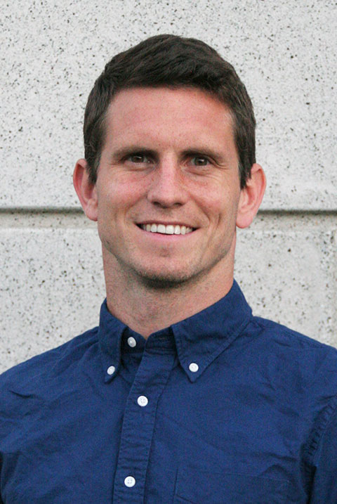

I'm an environmental economist and assistant professor at the [Vancouver School of Economics](http://economics.ubc.ca/). My work focuses on the economic impacts of climate change and electricity consumption.

. <!--Formerly, postdoctoral fellow at the [Stanford Center on Food Security and the Environment](http://fse.fsi.stanford.edu/) and Ph.D. student in [Agricultural and Resource Economics at UC-Berkeley](http://areweb.berkeley.edu).-->

<!-- E-mail: <a href="mailto:pbaylis@mail.ubc.ca">pbaylis@mail.ubc.ca</a> -->
